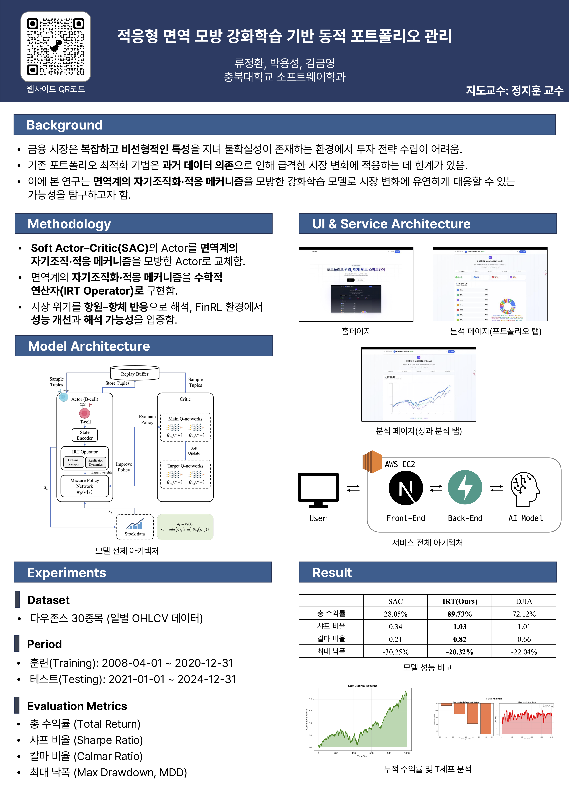

# FinRL-IRT: Crisis-Adaptive Portfolio Management



FinRL-IRT는 면역학적 Replicator-Transport 연산자를 금융 강화학습 파이프라인에 통합하여 시장 위기 상황에서도 안정적인 포트폴리오 운용을 달성하고자 하는 연구 프로젝트입니다. Stable Baselines3의 SAC 구조 위에 IRT Actor를 결합하고, 위기 감지(T-Cell) 및 최적수송(Sinkhorn)을 통해 위기 레짐 전환에 능동적으로 대응합니다.

## 프로젝트 개요

- 면역계의 B/T-Cell 원리를 차용하여 **위기 감지 → 학습률 가열 → 전문가 혼합**의 파이프라인을 구성합니다.
- Optimal Transport와 Replicator Dynamics를 결합한 `IRT` 연산자가 프로토타입 전략을 동적으로 혼합합니다.
- Stable Baselines3의 Critic을 재사용하면서 Actor만 커스텀 IRT Actor로 교체하여 기존 FinRL 코드베이스와 호환됩니다.
- 위기 민감 보상(`dsr_cvar`)과 시각화(XAI, 프로토타입 추적)를 통해 모델 해석성을 확보합니다.
- 학습·평가·문서화·테스트가 모두 포함된 재현 가능한 연구 버전을 제공합니다.

## 수학적 개요

\[
w*t = (1-\alpha_c)\, \tilde{w}\_t + \alpha_c\, P_t\mathbf{1}, \quad
\tilde{w}\_t \propto w*{t-1}\,\exp\{\eta(c_t)(f_t - \bar{f}\_t) - r_t\}
\]

- \(P_t\): Sinkhorn 알고리즘으로 계산한 최적수송 계획
- \(\alpha_c\): 위기 레벨 및 Sharpe 변화에 의해 조정되는 혼합 계수
- \(\eta(c_t)\): 위기 레벨에 따라 가열되는 Replicator 학습률
- \(r_t\): 자기-내성 서명과의 유사도에 기반한 억제 항

## 주요 구성 요소

- `finrl/agents/irt/irt_operator.py`: Sinkhorn 기반 비용 행렬 및 IRT 연산자 구현
- `finrl/agents/irt/bcell_actor.py`: 상태 인코딩, IRT 결합, Dirichlet 디코딩을 수행하는 B-Cell Actor
- `finrl/agents/irt/t_cell.py`: 시장 피처로부터 위기 타입 점수와 공자극 임베딩을 추정하는 경량 T-Cell
- `finrl/agents/irt/irt_policy.py`: SACPolicy를 상속받아 IRT Actor를 결합한 정책 클래스
- `scripts/train_irt.py`: 데이터 다운로드→환경 구성→학습→평가까지 일괄 수행하는 학습 스크립트
- `scripts/evaluate.py`: direct(deterministic) 및 drlagent 모드 평가, XAI·위험지표 추출 지원

## 디렉터리 요약

```
FinFlow-rl/
├── docs/                # 알고리즘 및 실험 문서
├── finrl/agents/irt/    # IRT 핵심 모듈 (B-Cell, T-Cell, IRT Operator, Policy)
├── scripts/             # 학습·평가 CLI 스크립트
├── tests/               # 단위 테스트 및 최소 재현 실험
├── requirements.txt     # 의존성 정의
├── pyproject.toml       # 패키징/빌드 설정
└── README.md            # 프로젝트 개요 (본 문서)
```

## 빠른 시작

1. **환경 설치**
   ```bash
   git clone <repo-url>
   cd FinFlow-rl
   pip install -r requirements.txt
   pip install -e .
   ```
2. **최소 실행 검증**
   ```bash
   python tests/test_finrl_minimal.py
   python tests/test_irt_policy.py
   ```
3. **브라우저 없이 로그만으로 결과 확인**: 모든 스크립트는 `logs/` 하위에 모델, 메타데이터, TensorBoard 로그를 남깁니다.

## 학습 및 평가 파이프라인

- **SAC/기본 알고리즘 학습**
  ```bash
  python scripts/train.py --model sac --mode both --episodes 200
  ```
- **IRT 전용 학습 + 즉시 평가**
  ```bash
  python scripts/train_irt.py --mode both --episodes 200 --alpha 0.45
  ```
- **평가 (direct / drlagent)**

  ```bash
  # direct 모드 (SB3 모델 직접 사용)
  python scripts/evaluate.py --model logs/irt/<time>/irt_final.zip --method direct --save-plot

  # drlagent 모드 (FinRL DRLAgent API)
  python scripts/evaluate.py --model logs/finrl_sac/<time>/sac_50k.zip --method drlagent
  ```

- **XAI 활성화 (direct 전용)**
  ```bash
  python scripts/evaluate.py --model logs/irt/<time>/irt_final.zip \
    --method direct --xai-level full --xai-target critic_q --xai-k 64
  ```

## 데이터 및 환경 설정

- 기본 종목: Dow Jones 30 (`finrl/config_tickers.py`)
- 학습 구간: 2008-04-01 ~ 2020-12-31 / 평가 구간: 2021-01-01 ~ 2024-12-31 (`finrl/config.py`)
- 기술지표: MACD, Bollinger Band, RSI 등 8종 (`INDICATORS`)
- 보상 설정: `reward_type='dsr_cvar'` 사용 시 DSR·CVaR 특성이 상태에 포함되고 IRT Actor가 Sharpe/CVaR 신호를 함께 사용합니다.

## 재현성 체크리스트

- `scripts/train_irt.py`는 `--seed` 인자를 받아 난수 시드를 고정합니다.
- 학습 시 메타데이터(`env_meta.json`)가 자동 저장되며 평가 시 동일 구성을 복원합니다.
- `tests/` 디렉터리의 단위 테스트로 forward pass, simplex 제약, Critic 연동을 매번 검증합니다.
- TensorBoard 로그는 `logs/<model>/tensorboard/`에 기록되어 실험 비교가 용이합니다.

## 문서 및 참고 자료

- `docs/IRT.md`: IRT 연산자, 위기 감지, 비용 함수에 대한 상세 수식 및 알고리즘 설명
- `docs/SCRIPTS.md`: 학습/평가 스크립트별 인자 설명과 사용 예시

## 라이선스 및 문의

- 라이선스: MIT (자세한 내용은 [LICENSE](LICENSE) 참조)
- 이슈/기여: GitHub Issues 및 Pull Request를 통해 제보 혹은 토론 바랍니다.
- 학술 협업 및 문의: 프로젝트 저장소의 Discussions 탭을 활용해 주세요.
